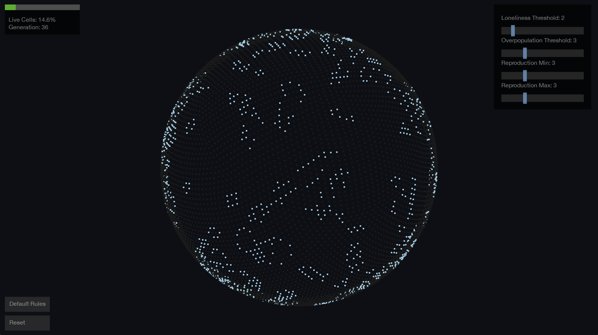

# Spherical Game of Life

An implementation of Conway's Game of Life on a spherical surface using the HEALPix (Hierarchical Equal Area isoLatitude Pixelization) grid system. This project explores emergent behavior in cellular automata when constrained to a spherical topology.

[](docs/images/screenshot1.png)

## Background

### Why Spherical?

Most implementations of Conway's Game of Life operate on a flat grid with either bounded edges or torus topology (wrapping around edges). While the torus topology eliminates edge effects, it introduces its own geometric artifacts due to the toroidal surface's fundamental shape. A sphere provides a natural boundary-free surface for cellular automata to evolve, allowing for truly continuous patterns without edge artifacts.

### Why HEALPix?

The HEALPix (Hierarchical Equal Area isoLatitude Pixelization) framework, originally developed for cosmic microwave background radiation analysis, provides an elegant solution to the sphere discretization problem. HEALPix offers several crucial properties that make it ideal for spherical Game of Life:

1. **Equal Areas**: All pixels have the same surface area, ensuring uniform cellular distribution
2. **Hierarchical Structure**: The grid can be refined to different resolutions while maintaining its fundamental properties
3. **Uniform Connectivity**: Each pixel has exactly 8 neighbors (except for a small number of pixels that have 7 or 9), closely matching Conway's original 8-neighbor rule
4. **No Singularities**: Unlike latitude-longitude grids, HEALPix avoids polar singularities

### Emergent Behavior

This implementation allows for the exploration of emergent patterns in cellular automata when constrained to a spherical surface. Some interesting phenomena to observe:

- Pattern propagation across the sphere's curvature
- Formation and interaction of stable structures on curved space
- Global population dynamics in a finite but boundaryless system
- Emergence of rotating patterns that leverage the sphere's symmetries

## Features

- Real-time 3D visualization with OpenGL
- Interactive rotation and zoom controls
- Adjustable Game of Life rules via UI sliders
- Population monitoring with health indicator
- Generation counter
- Automatic camera rotation for pattern observation

## Installation

Requirements:
```bash
python >= 3.7
pygame
numpy
healpy
PyOpenGL
PyOpenGL-accelerate
```

Setup:
```bash
# Clone the repository
git clone https://github.com/yourusername/spherical-game-of-life.git
cd spherical-game-of-life

# Create and activate virtual environment
python -m venv venv
source venv/bin/activate  # On Windows: venv\Scripts\activate

# Install dependencies
pip install -r requirements.txt
```

## Usage

Run the simulation:
```bash
python spherical_life.py
```

### Controls

- **Left mouse button + drag**: Rotate view
- **Mouse wheel**: Zoom in/out
- **Rule Sliders**: 
  - Loneliness Threshold: Cells die if they have fewer than this many neighbors
  - Overpopulation Threshold: Cells die if they have more than this many neighbors
  - Reproduction Min/Max: Dead cells become alive if their neighbor count is within this range
- **Reset**: Generate new random initial state
- **Default Rules**: Reset to original Conway's Game of Life rules
- **ESC**: Quit

## Attribution

This project makes use of the HEALPix framework:

> HEALPix: A Framework for High-Resolution Discretization and Fast Analysis of Data Distributed on the Sphere
> K.M. Górski, E. Hivon, A.J. Banday, B.D. Wandelt, F.K. Hansen, M. Reinecke, M. Bartelmann
> ApJ, 622, 759-771, 2005

The HEALPix package is available at [healpix.sourceforge.io](http://healpix.sourceforge.io) and is distributed under the GNU General Public License.

## License

This project is licensed under the GNU General Public License v3.0 - see the [LICENSE](LICENSE) file for details.

### Dependency Licenses

This project incorporates material from several open-source projects:

- [HEALPix](http://healpix.sourceforge.io/) (GPL-2.0+) - Used for spherical grid implementation
- [PyOpenGL](http://pyopengl.sourceforge.net/) (BSD 3-Clause) - Used for 3D rendering
- [Pygame](https://www.pygame.org/) (LGPL) - Used for window management and user interface
- [NumPy](https://numpy.org/) (BSD 3-Clause) - Used for numerical computations

In accordance with the GPL, the complete source code of this project and any modifications to GPL-licensed components are made available under the same license terms.

### Rights Granted

Under this license, you are free to:
- Use this software for any purpose
- Change the software to suit your needs
- Share the software with others
- Share your changes with others

### Obligations

When using this software, you must:
- Include the original license and copyright notices
- Make your source code available when distributing the software
- Document changes you make to the software
- Use the same license (GPL-3.0) for any derivative works
